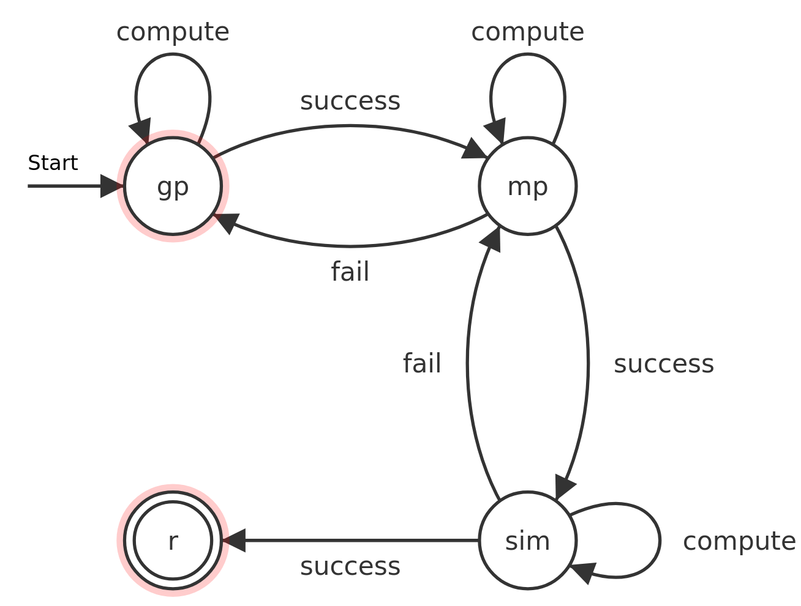

# CAROL - CAd-based gRasp mOtion pLanning

## What it is
This is a setup to plan a grasp and a motion for a robot. A planned robot motion can be validated by a simulation.
Currently only Gazebo (shipping with ROS Melodic installation) as simulation is implemented.
These components communicate with each other via ROS topics.
These components not only do the grasp or motion planning but contain also the ability to gain information from other components and react according to these events.
E.g. if the motion planner doesn't find a valid motion for the given grasps the grasp planner will generate new grasps.
Additionally these components are not dependent on each other. 
Available components in this setup:
* gp = grasp planner
* mp = motion planner
* sim = simulation
* r = robot

### moveitCpp
Motion planner that uses the component [MoveIt!](http://docs.ros.org/en/melodic/api/moveit_tutorials/html/index.html) that is integrated in ROS very well.
The motion planner gets grasps from the grasp planner and tries to find a motion ending in the desired grasp pose.
If it finds a motion it will send it to the simulation and waits for the simulation to tell if this motion can be executed or will lead to any collision.
### graspitCpp
Grasp planner that uses [GraspIt!](https://graspit-simulator.github.io/build/html/index.html) to execute the grasp planning.
It will generate new grasps as long as the motion planner doesn't find a valid motion or tells the grasp planner to stop.
### youBot
Robot specific component that includes the drivers to control a robot. In this case the Kuka YouBot will be controlled.

## Tested setup
* Ubuntu 18.04
* ROS Melodic 1.14.10

## Prepare
* Install ROS melodic according to [this](http://wiki.ros.org/melodic/Installation/Ubuntu) - install the full desktop version to get the simulator and visualization tools
* Install GraspIt according to [this](https://graspit-simulator.github.io/build/html/installation_linux.html)
* If a build fails due to an Eigen3 error you may have to create a symlink like this
  * `sudo ln -s /usr/include/eigen3/Eigen /usr/local/include/Eigen`
* If you want to use the youBot install the [drivers](https://github.com/youbot/youbot_driver)
* Create a catkin_ws, add the following repositories and build them with `catkin build`:
  * For GraspIt ROS interface [this](https://github.com/JenniferBuehler/graspit-pkgs)
  * To create the GraspIt World files you will need [this](https://github.com/JenniferBuehler/ivcon)
  * For robot specific catkin packages with Kuka YouBot as example [this](https://github.com/XITASO/CAROL_catkin_ws)
*  Set the environment variable IVCON to the path where the binary of this package is build
* Add the template file for GraspIt in the $GRASPIT home folder
* Add the template folder for Gazebo in your ~/.gazebo/models/  directory

Plannings for new STL files can be started if you created the GraspIt and Gazebo models for that with the following terminal commands:
* ./createGraspitFromStl.bash $path_to_your_stl_file
* python3 create_gazebo_files/main.py $path_to_your_stl_file

## Run

First you have to adapt some pathes in the startSession.bash file to your own setup and specify which object you want to grasp.
After that just run `./startSession.bash`
